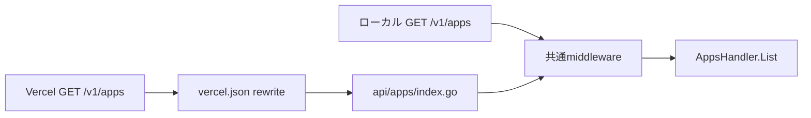
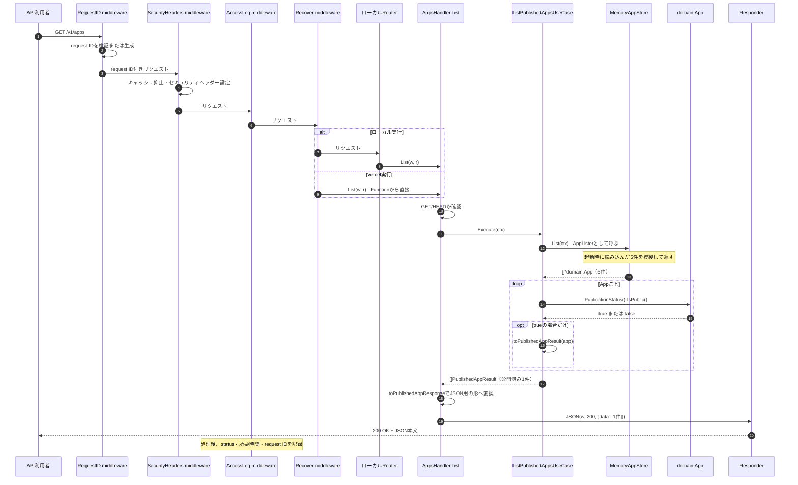
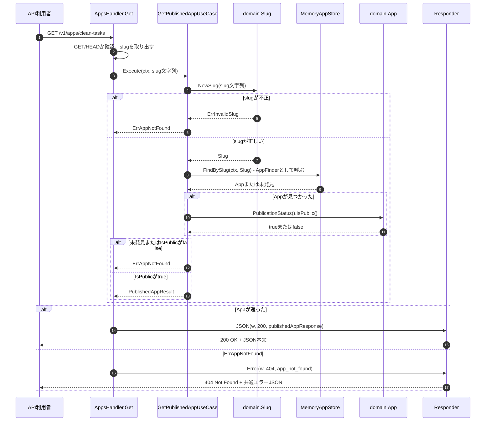

# Contentの処理の流れ

この図は、現在実装されている公開アプリ一覧APIの処理を示します。HTTPからメモリ上の取得元までつながっています。

## 名前を日本語にすると

| コードの名前 | ここでの意味 | 具体例 |
| --- | --- | --- |
| `domain.App` | アプリを表すデータと振る舞い | Clean Tasksの名前、説明、公開状態 |
| `domain.PublicationStatus` | 公開準備中か公開済みか | `preparing` / `published` |
| `IsPublic()` | 公開APIに出してよいか尋ねる | `published` なら `true` |
| `ListPublishedAppsUseCase` | 公開済みアプリの一覧を作る処理 | 全アプリを取得し、準備中を除外する |
| `Execute(ctx)` | その処理を実行する | 一覧を返す。`ctx` は中断や期限を伝える値 |
| `AppLister` | 「アプリ一覧を取得できる」という約束 | `List(ctx)` メソッドを持つinterface |
| `List(ctx)` | 取得元から全アプリを読む | 戻り値はAppの一覧とエラー |
| `MemoryAppStore` | メモリに置いたアプリを返す実体 | `List(ctx)` を持つため `AppLister` として渡せる |
| `NewSeededMemoryAppStore()` | hogedd-webの現行定義5件を読み込む準備 | 公開済み1件、準備中4件 |
| `stubPublishedApps` | Use Caseだけのテストで使う仮の取得元 | エラーや任意のAppを返せる |
| `PublishedAppResult` | Use Caseが返す公開用のデータ | 一覧の1件分 |
| `AppsHandler` | HTTPリクエストとJSONレスポンスを担当する | `/v1/apps` を受け、Use Caseの結果をJSONへ変換 |

`Lister` は「一覧を取得するもの」、`UseCase` は「利用者が達成したい一つの操作」、`Result` は「その操作の結果」という意味です。`port` はUse Caseが外部に求める窓口の呼び名で、ここでは `AppLister` がその役目です。新しい実体が一つ増えるわけではありません。

## リクエスト前の準備

サーバー起動時に `internal/app.New` が `NewSeededMemoryAppStore()` で5件を読み込み、Use CaseとHTTP Handlerを組み立てます。リクエストのたびに5件を作り直すわけではありません。Use Caseには `AppLister` というinterfaceを満たす `MemoryAppStore` を渡しています。

## HTTPの入口

ローカルでは `internal/transport/httpapi.NewRouter` がパスを選びます。Vercelではrewrite後のFunctionが同じ `AppsHandler.List` を呼びます。以下は両方に共通する処理です。

## 一覧取得: GET /v1/apps

ここで `PublishedAppResult` はUse Caseの結果、`publishedAppResponse` はHTTPレスポンス用の型です。後者が `published_at` のようなJSON名と日時表現を決めます。準備中の4件を除外する判断はUse Caseが `domain.App` の公開状態を使って行い、StoreやHandlerには置きません。

`AppLister` は保存場所そのものではありません。`List(context.Context) ([]*domain.App, error)` というメソッドの形を定めるinterfaceです。`MemoryAppStore` に同じ形の `List` メソッドがあるため、明示的な `implements` 宣言なしでUse Caseへ渡せます。将来DBへ移す際も、この約束を満たす取得元へ交換できます。

## 1件取得: GET /v1/apps/{slug}

一覧と同じmiddlewareを通った後の流れです。Vercelではrewriteの `slug` を `api/apps/detail/index.go` がpath valueへ渡します。

不正なslug、存在しないApp、準備中のAppはいずれも同じ `404` です。Storeから予期しないエラーが返った場合はログへ詳細を残し、利用者には内部情報を含まない `500` を返します。`HEAD` は同じ判定を行いますが、レスポンス本文を返しません。GET/HEAD以外は `405` と `Allow: GET, HEAD` を返します。

## まだ接続していない部分

`hogedd-web` はまだこのAPIを呼んでいません。今後、Web側の表示を静的定義からAPI参照へ移す作業が必要です。現在の `GET /health` は運用機能で、このContentの処理には接続されていません。
